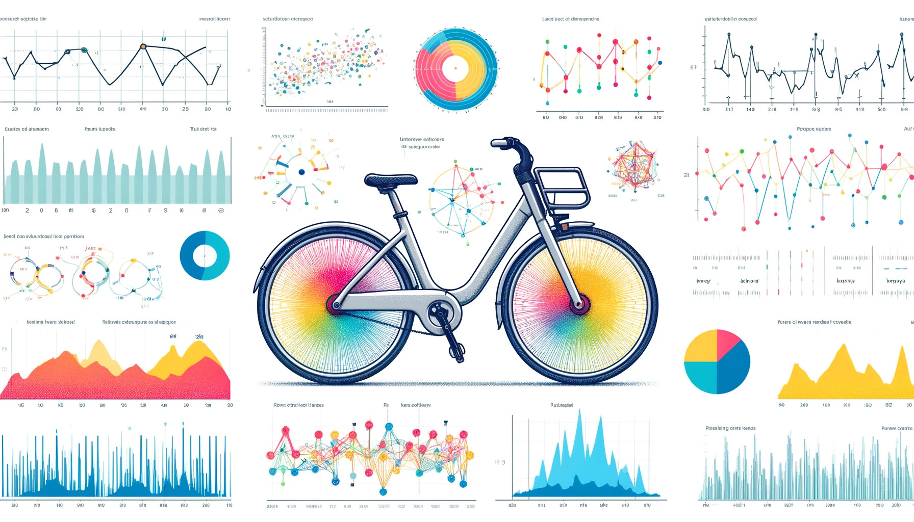
<h1 align="center">Cycles of Demand: Predicting Washington DC's E-Bike Rentals Usage </h1>

<a href="https://nbviewer.org/github/BrianMillerS/ebike_usage_regression/blob/main/ebike_regression_analysis.ipynb" target="_blank">Jupyter Notebook Viewer</a>    
<a href="https://raw.githubusercontent.com/BrianMillerS/ebike_usage_regression/4b5c92868da7195f29ce5d69f1c4bfb0d9f21a0b/BM_ebike_usage_presentation.pdf" target="_blank"> Download Powerpoint Presentation</a>
 

# Table of contents
- [Project Takeaway](#Project-Takeaway)
- [Description of the Data](#Description-of-the-Data)
- [Methods Overview](#methods-overview)
- [Project Summary](#project-summary)

# Project Takeaway
The goal of this project was to understand the patterns of E-bike usage and create a predictive model that can forecast the number of riders per hour based on time and weather conditions.
- Six models were tested: Linear Regression, Decision Tree Regressor, Random Forest Regressor, SGD Regressor, Bagging Regressor.
- Random Forest Regressor had the best performace after parameter tuning with a R^2 = 0.89 and RMSE = 0.33 (6-fold xval).
- Warmer weather, less humidity, and it being rush hour times were the best predictors of E-bike usage.

The insights from this project could enable Capital Bikeshare and similar companies to make evidence-based decisions about where and when to allocate resources, leading to increased operational efficiency and customer satisfaction.  

  

### Potential business changes could include:

 - Increase E-Bike redistribution before rush hour to capitalize on commuter usage.
 - Add E-Bike charging stations near dense employment locations.
 - Offer discounts or incentives during no-optimal weather conditions.
 - If E-Bike rollbacks or updates need to be done, perform them during non-peak
months

# Description of the Data
The dataset is 2 years of E-bike usage, broken down by every hour of the day. All the data is publicly available from <a href="https://capitalbikeshare.com/" target="_blank">Capital Bikeshare</a>, this includes weather data for the Washington, D.C. area. 

Lets take a look at all of the data in our dataset.  
We have:  
  - 11 predictor variables  
  - 1 outcome variable (number of rides for that hour)

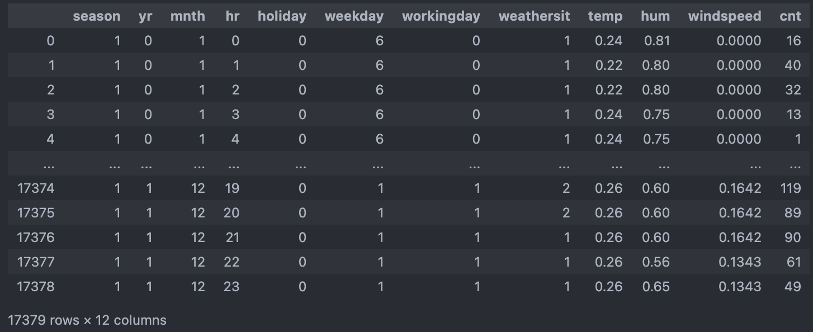

# Methods Overview
+ Exploratory Data Analysis
  + Checking Data Quality (data types, null values)
  + Visualizing Numeric and Categorical Predictor Variables
  + Explore Variables Most Correlated with E-Bike Usage
+ Data Preparation
  + Drop Redundant Variables
  + Standard Scale Numeric Variables
  + One-Hot Encode Categorical Variables
  + Split Data (70 training/ 30 test)
+ Model Building
  + Linear Regression
  + Decision Tree Regressor
  + SGD Regressor
  + Bagging Regressor 
  + Random Forest Regressor
  + Compare results of R^2 and RMSE (6-fold cross-validation)
+ Model Parameter Tuning
  + Iterative Randomized Search for Random Forest Regressor
+ Model Evaluation
  + R^2, RMSE
  + Residuals vs Actual, Predicted vs Actual
  + Identifying the Most Important Variables, Mean Gini Decrease

# Project Summary
- [Exploratory Data Analysis](#Exploratory-Data-Analysis)
- [Model Building](#Model-Building)
- [Model Parameter Tuning](#Model-Parameter-Tuning)
- [Model Evaluation](#Model-Evaluation)
- [Determining Important Variables](#Determining-Important-Variables)

   

## Exploratory Data Analysis  

### Categorical Variables
Our categorical variables can be broken up into two types:
- Time (season, month, day, hour)
- Weather Status (Clear, Couldy/Misty, Light Rain/Snow, Heavy Rain/Snow)  
 

Looking at the plots there are a few takeaways:
- More rides during the summer, fall, and winter seasons (the warmer seasons)
- More rides on the weekends
- More rides when the weather is better

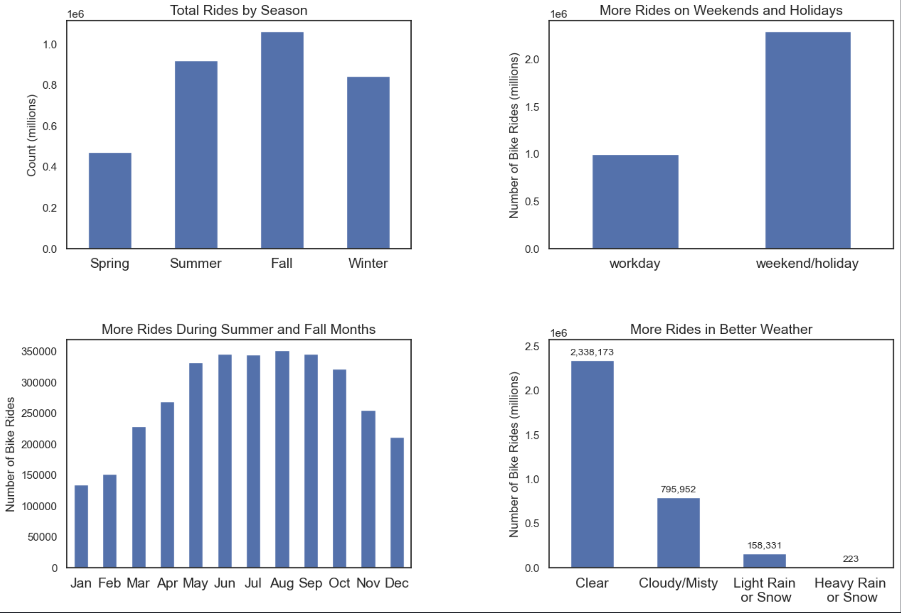   
   

Now let's dive a little deeper and break down the average day for an E-bike user:
- Not suprisingly, rides happen most during the waking hours of a day
- Peak usage times happen during work days when people commute to and from work
- 
  
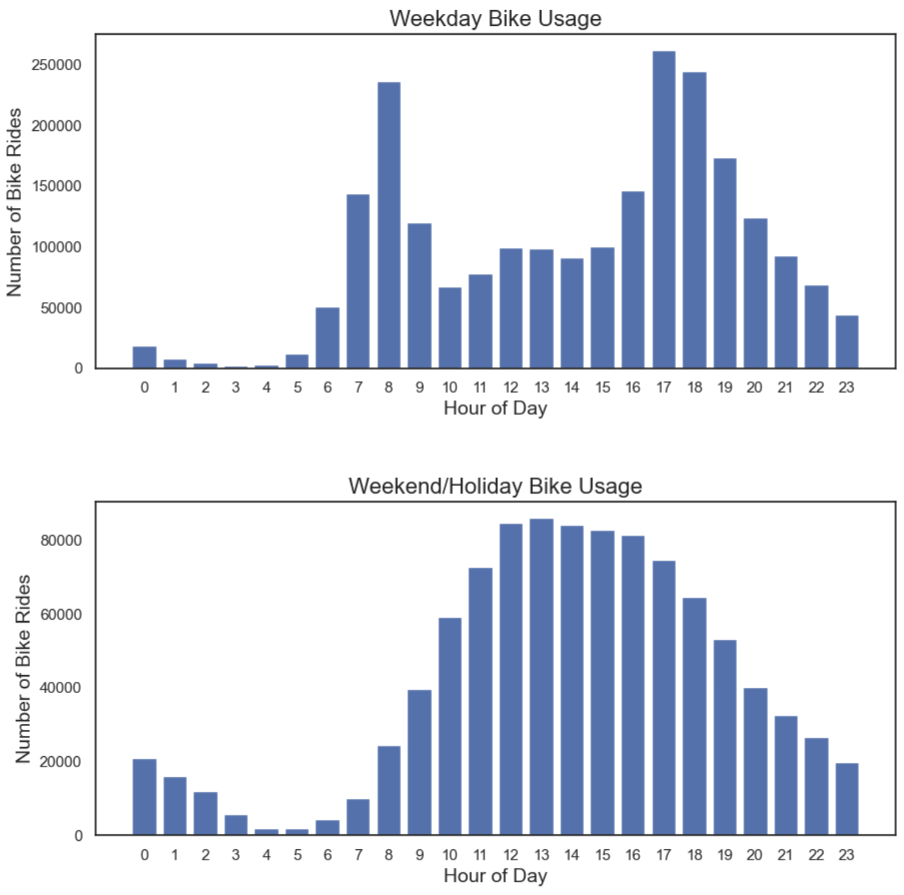
 

Finally let's break down the interplay between weather for a given season:
- Bad weather really does dissuade riders, regarless of season
- Again we see a trend for more rides during warmer months

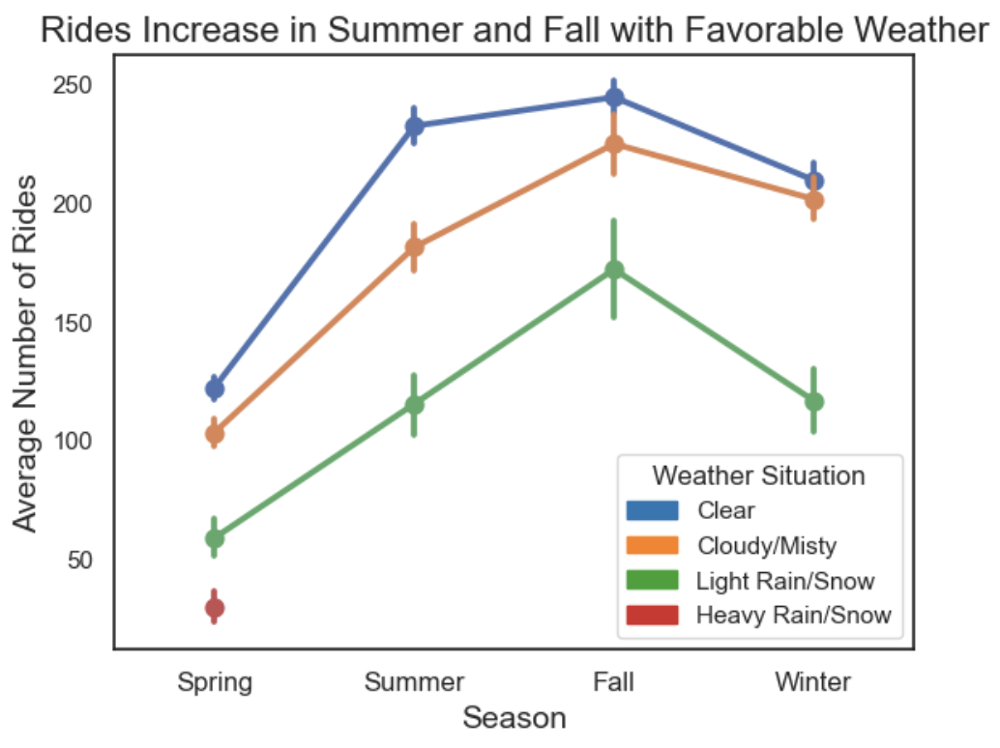 

Explanation of Weather Situations:
- Clear: Clear, Few clouds, Partly cloudy, Partly cloud
- Cloudy/Misty: Mist or Cloudy, Mist or Broken clouds, Mist or Few clouds, Mist
- Light Rain/Snow: Light Snow, Light Rain or Thunderstorm or Scattered clouds, Light Rain or Scattered clouds
- Heavy Rain/Snow: Heavy Rain or Ice Pallets or Thunderstorm or Mist, Snow or Fog

 

### Numerical Variables
Our categorical variabeles are the following:
- Temperature
- Humidity
- Wind speed

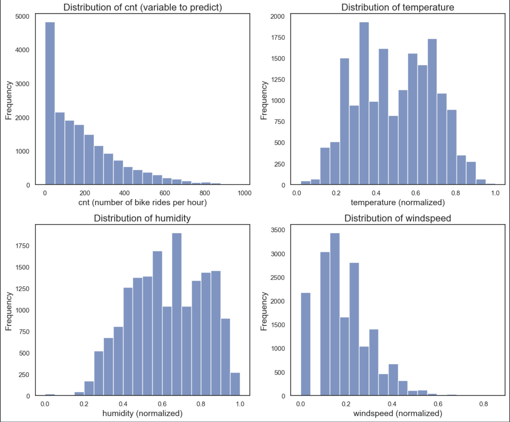
   

Creating a quick Pearson's Correlation heatmat we can see:
- More rides in higher temperatures
- Less rides in higher humidities
- Rides are pretty indiferent about weather it's windy out
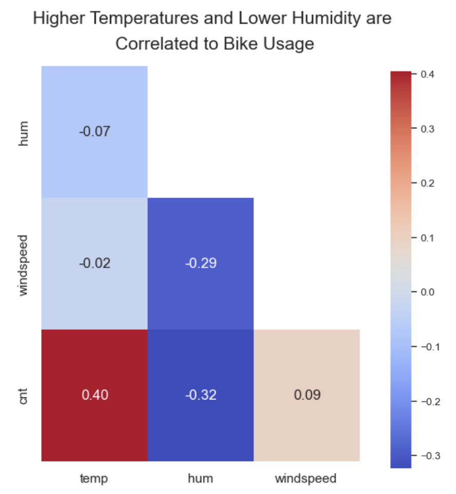
   

## Model Building  
In order to train our models, the data was split into 70% training/ 30% testing

 
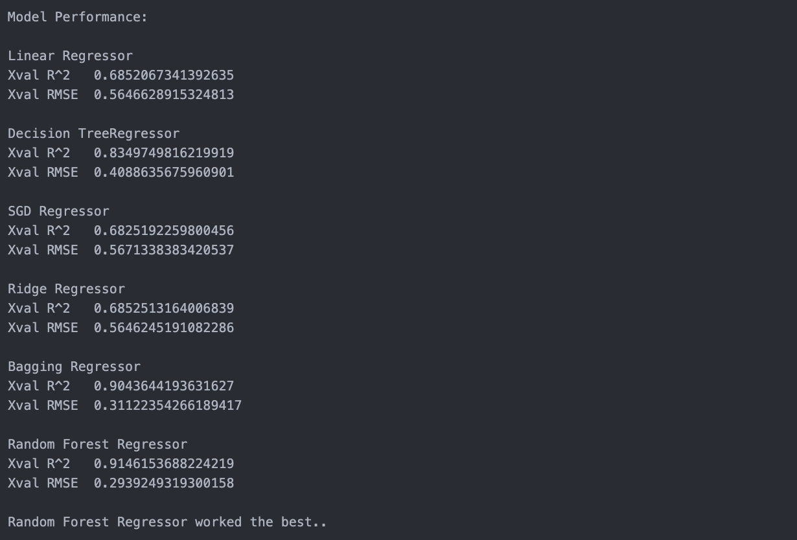
 
From this point on in the analysis, we will focus on the top performing model: Random Forests Regressor

## Model Parameter Tuning
Random Forest Regressor had the best results, but let's see if we can do better.
 
An iterative randomized search was performed on the RF model. This approach is fast and still ensures that we are sampling the parameter space well by doing 20 different attempts.
 
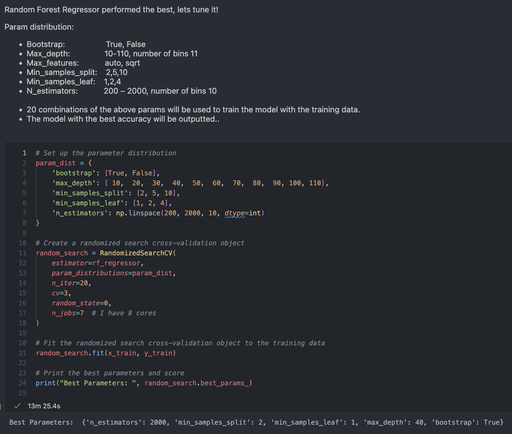
 

## Model Evaluation
Now with the best model selected, and parameters tuned, we can evaluate the model and see how it performed.
 
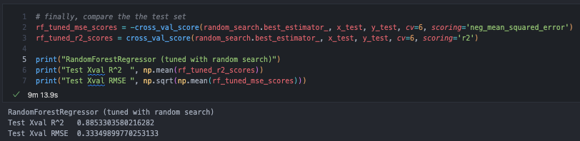
 

 
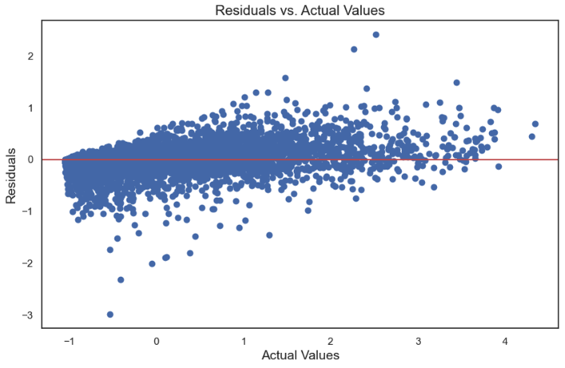
 

 
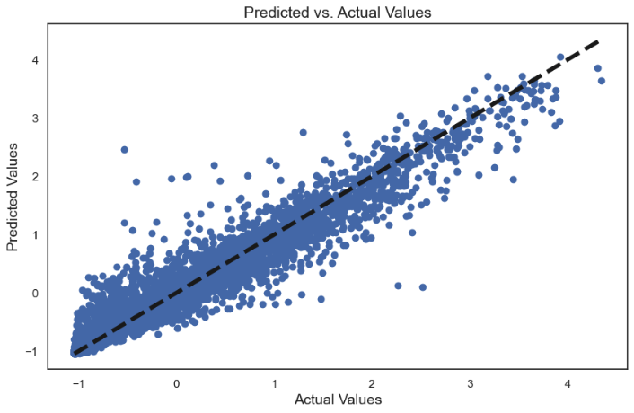
 

Overall, the model appears to be performing well, with good predictive power and a balance of error types that lean towards correct predictions.

## Determining Important Variables

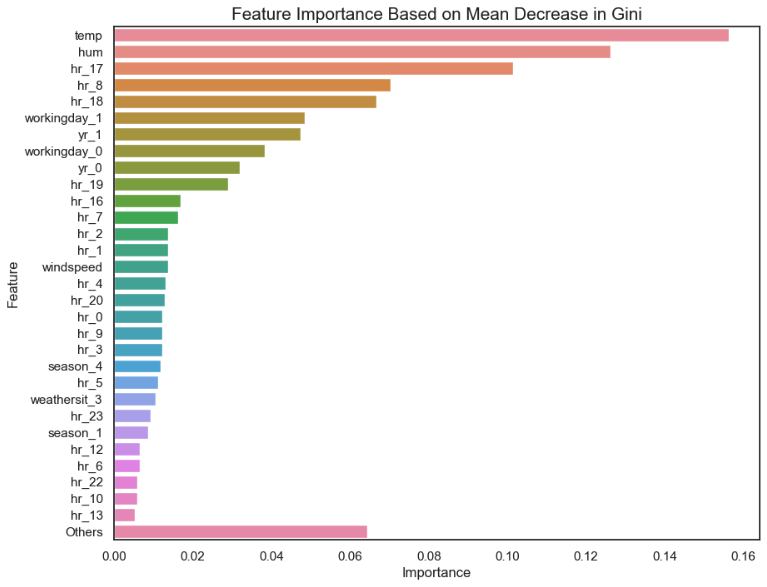

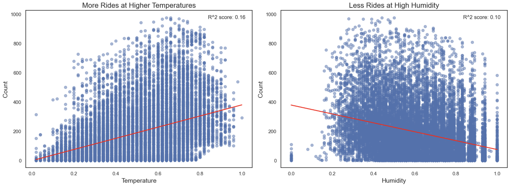

